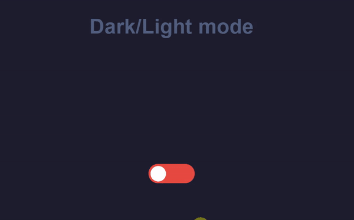

# Dark and light moe demo

This is a demo react app demo to swich between dark and white.
The app uses a theme context and a theme wrapper.
For styling:

- Bootstrap and Reactstrap

Open [App's live demo](https://dark-mode-demo-gamma.vercel.app/)
Open [Article about steps to follow to build the dark mode app step by step](https://famzil.medium.com/dark-mode-in-react-533faaee3c6e?source=your_stories_page-------------------------------------)
# Demo

# Install the app

### `npm install`

or

### `yarn install`

## Run the app

In the project directory, you can run:

### `npm start`

or

### `yarn start`

Runs the app in the development mode.\
Open [http://localhost:3000](http://localhost:3000) to view it in the browser.

The page will reload if you make edits.\
You will also see any lint errors in the console.
